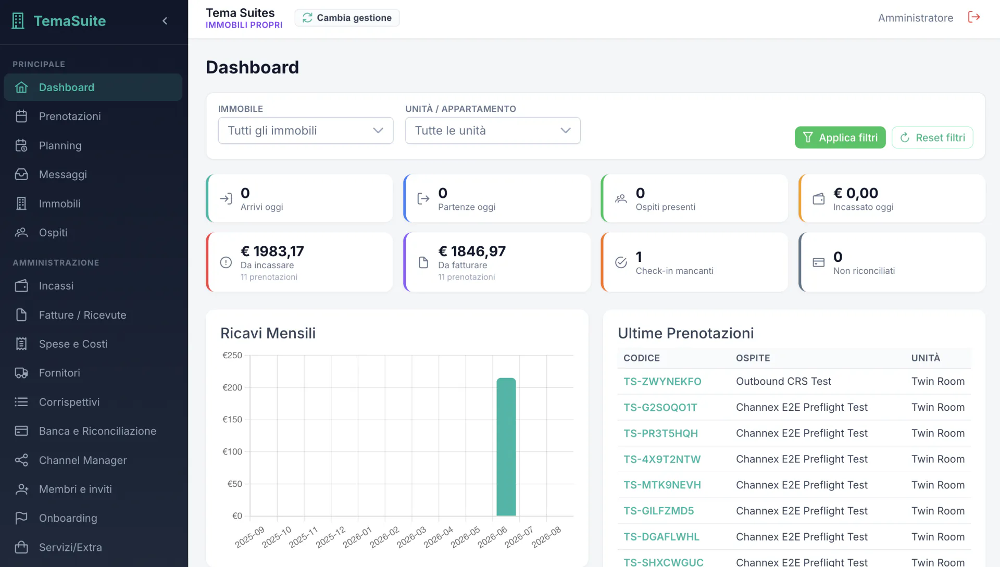
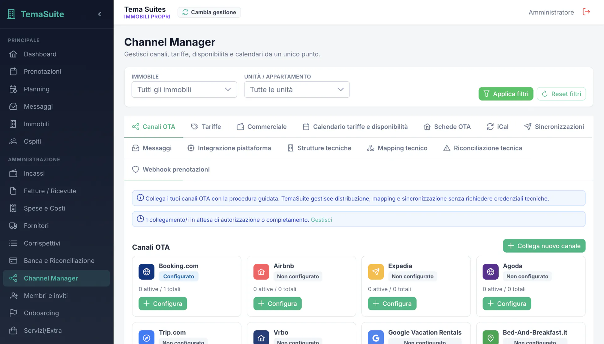

# TemaSuite — multi-company SaaS for property managers

> A hospitality management platform: bookings, guests, units, rates, channel distribution and a
> complete accounting cycle, for property managers running more than one company.

**Role** — full-stack architecture, backend API, frontend, data model and operational workflows.
**Stack** — Laravel 13 · Angular 21 · PrimeNG · Stripe · relational data layer.
**Status** — in production, multi-company.

---

## The problem

A property manager does not run one business, they run several at once: the booking calendar,
the OTA channels the bookings arrive from, the guests who have to be identified at check-in, and
the accounting that has to reconcile all of it at the end of the month. Most operators solve this
with a booking tool, a separate channel manager, a spreadsheet and an accountant — four systems
that disagree about the same night in the same room.

The disagreement is expensive. An availability that did not sync becomes an overbooking. A
payment that was never reconciled becomes an invoice nobody issued.

## What I built

A single platform where the reservation, the channel distribution, the guest identity and the
accounting entry are the same object seen from different modules — and where a property manager
managing several companies keeps them properly separated inside one login.

## Key capabilities

- **Operational dashboard** — arrivals and departures for the day, guests in house, collected and
  outstanding amounts, pending invoices, missing check-ins and unreconciled movements.
- **Channel Manager** — guided OTA connection, rate plans, a price and availability calendar,
  listings, iCal, technical mapping and reconciliation, and booking webhooks.
- **Price Advisor** — competitor monitoring to support rate decisions.
- **Online check-in** — guest identification with OCR and identity verification.
- **Full accounting cycle** — payments, invoices and receipts, expenses, suppliers, takings,
  banking and bank reconciliation, plus city tax and depreciation.
- **Electronic invoicing** — numbering, PDF and document status kept aligned with the e-invoicing
  service.
- **Multi-company** — each owner runs with its own runtime context, configuration and data.
- **Installable client** — the front end ships as a PWA with a service worker.

## Architecture

The domain is wide rather than deep — 97 models and 81 migrations — so the architectural work was
mostly about keeping that width from turning into coupling.

## Engineering decisions

**An outbox for anything that leaves the system.** Rate and availability updates going out to OTA
channels are written as events in the same transaction as the change that caused them, then
delivered separately. Without that, a failed HTTP call to a channel leaves the platform and the
channel permanently disagreeing — the exact failure that causes overbookings.

**Per-owner runtime context instead of per-owner code.** Multi-company is resolved by a runtime
context and configuration resolver rather than by branching, so adding a company is data, not a
deployment.

**Feature flags as a first-class service.** A module can reach production disabled. On a platform
where one codebase serves several companies, this is the difference between shipping weekly and
shipping when everyone is ready.

**Accounting modelled as its own domain.** Invoicing, reconciliation, revenue recognition and
tax are separate services with their own rules, not fields hanging off a booking. Fiscal logic
changes on a legislative schedule that has nothing to do with the product roadmap, and this keeps
those two clocks apart.

**Angular with a component library, on purpose.** A back office of this size is dozens of dense
data tables and forms. A mature component library beats hand-rolled UI here, and the framework's
opinionated structure is an advantage when the surface is this large.

## Security and privacy

Roles and permissions are enforced server-side, with an activity log over the operations that
matter. Guest identity data from online check-in is treated as sensitive throughout. Payments run
through Stripe rather than being handled in-house. Each company's data is isolated by the runtime
context, and the platform is covered by automated tests with a controlled deployment path.

Specific endpoints, providers, infrastructure and client identities are deliberately not
described here.

## Tech stack

`Laravel 13` `PHP 8.3` `Angular 21` `PrimeNG` `PWA / service worker` `Stripe`
`role-based permissions` `activity log` `Excel & PDF export` `relational database`

## Result

The platform runs in production for multiple companies, covering the chain from a booking arriving
on an OTA channel to the reconciled accounting entry. Scale of the domain, measured directly on
the repository: **97 models, 81 migrations**.

## Source code

The source code is maintained in a private repository: TemaSuite is a commercial SaaS product.
This repository documents the architecture, the engineering decisions and the product work.

## Links

- **Interactive case study** — [francescoiaforte.vercel.app/en/projects/property-manager-saas](https://francescoiaforte.vercel.app/en/projects/property-manager-saas)
- **Profile** — [github.com/francescoveryra-dot](https://github.com/francescoveryra-dot)
- **Full portfolio** — [francescoiaforte.vercel.app](https://francescoiaforte.vercel.app)
